# Megalink viewer: setup guide

This guide takes you from an empty SD card to a screen beside a firing point,
showing that shooter's scores live from Megalink Live. It needs no programming
and no keyboard. You set everything up from your phone.

It is written for the ready-made image, the easiest way to set up a display. If
you would rather install on a Raspberry Pi you already use, see
[docs/RASPBERRY-PI.md](https://github.com/null-jones/rpi-megalink-viewer/blob/main/docs/RASPBERRY-PI.md).

## Before you start

### What a display is

A display is a small Raspberry Pi computer plugged into a screen. It shows one
firing point's card as the shooter fires: the target with their shots on it,
their series and total, and the range clock. It gets the scores from Megalink
Live over the internet, the same scores
[live.megalink.no](https://live.megalink.no/) shows in a web browser.

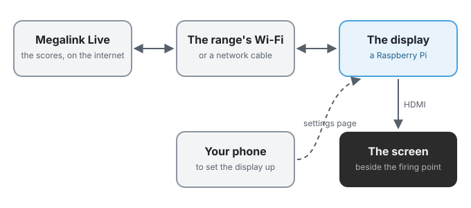

Once it is set up, a display needs nothing from anybody. Switch it on and it
shows its firing point. Switch it off at the wall whenever you like.

### What you need

For each display:

| Item | Notes |
|---|---|
| **A Raspberry Pi** | A Pi Zero 2 W, 3, 4 or 5. A Pi 4 or Pi 5 can drive **two screens**, one firing point on each. |
| **A microSD card** | 8 GB or larger. Any brand sold for cameras is fine. |
| **A power supply** | The official one for your Pi is the safest choice: a weak supply is the most common cause of a display that restarts by itself. |
| **A screen with HDMI** | Any TV or computer monitor. |
| **An HDMI cable** | A Pi 4 and Pi 5 have *micro* HDMI sockets and a Pi Zero 2 W has *mini* HDMI, so you need a cable or adapter with the right end. |

And once, for setting up:

- **A computer with an SD card reader**, to put the software on the card.
- **A phone** with a camera. Any smartphone that can scan a QR code will do.
- **The range's Wi-Fi name and password**, or a network cable to plug in.

> [!NOTE]
> An original Pi Zero, and the Pi 1 and Pi 2, cannot run the ready-made image.

### Which Pi to choose

| | Pi Zero 2 W | Pi 3 | Pi 4 / Pi 5 |
|---|---|---|---|
| Screens | One | One | One or two |
| Window mode (the usual) | Yes | Yes | Yes |
| Web browser mode | Slow | Slow | Yes |
| Connects by | Wi-Fi | Wi-Fi or cable | Wi-Fi or cable |

Most ranges want **window mode**, which draws the scores itself and works on
every Pi. Web browser mode shows Megalink's own web page instead, and needs a
Pi 4 or Pi 5 to be quick. *Ways to show the scores* explains the difference.

## Put the software on the card

You do this once for each display, on your computer.

### 1. Download the display software

Go to the project's releases page and download the newest
`megalink-display-…img.xz` file, about 800 MB:

**<https://github.com/null-jones/rpi-megalink-viewer/releases/latest>**

Leave it as it is. There is no need to unzip it.

### 2. Get Raspberry Pi Imager

Raspberry Pi Imager is Raspberry Pi's own free program for writing SD cards.
Download it for Windows, macOS or Linux from
**<https://www.raspberrypi.com/software/>** and install it.

### 3. Write the card

Put the microSD card in your computer, open Raspberry Pi Imager, and work
through its steps:

1. **Device:** choose your model of Raspberry Pi.
2. **Operating system:** scroll to the bottom of the list and choose
   **Use Custom**, then pick the `megalink-display-…img.xz` file you
   downloaded.
3. **Storage:** choose your SD card. Check it is the card and not another
   drive: everything on it is erased.
4. **Settings:** if Imager offers to customise the settings, you can set the
   **Wi-Fi name, password and country** here, and the display joins that network
   by itself. This is optional: the display can also be put on your Wi-Fi from
   your phone later, in *Get it on the network*.
5. **Write**, and wait for Imager to write and check the card. This takes a few
   minutes.

> [!TIP]
> Setting up several displays? Write one card, set that display up, then write
> the rest. Everything you learn on the first saves time on the others.

> [!NOTE]
> Leave Imager's other settings (the user name, password and SSH) blank unless
> you want to log in to the display with a keyboard or from a computer. Nothing
> in this guide needs them.

## Switch it on

### 4. Plug it in

1. Put the card in the Raspberry Pi.
2. Plug the screen into the Pi's HDMI socket. On a Pi 4 or Pi 5, use
   **HDMI 0**, the one next to the power socket.
3. If you are using a network cable, plug that in too.
4. Switch the screen on, and plug in the Pi's power last.

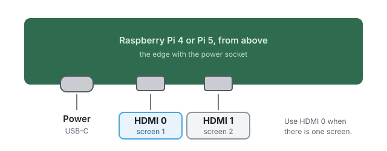

The first start takes a minute or two longer than later ones, while the Pi
prepares its card. You may see the Raspberry Pi logo, some lines of text, and
then this for a moment:

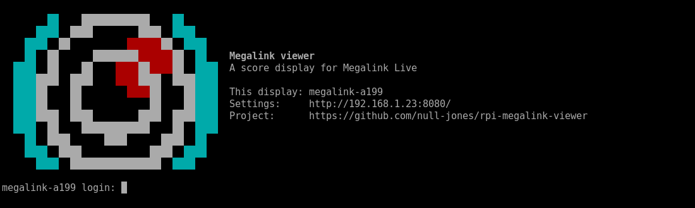

Every display gives itself a name, like **megalink-a199**, made from its serial
number. You will see it on the screen and on your phone, and it is how you
tell one display from another.

### What you see next

What happens next depends on whether the display can reach a network:

- **It is on a network:** you see **Set up this display** with one QR code.
  Carry on with *Choose what to show*.
- **It has no network yet:** you see **Waiting for a network…** and a countdown.
  Carry on with *Get it on the network*.

## Get it on the network

A display needs to be on a network with internet access to get the scores. If
you set up the Wi-Fi in Imager, or plugged in a network cable, it is probably
already there: skip to *Choose what to show*.

### While it looks for a network

For its first 30 seconds, a display looks for a network it knows. The screen
counts down, so you can see it is working.

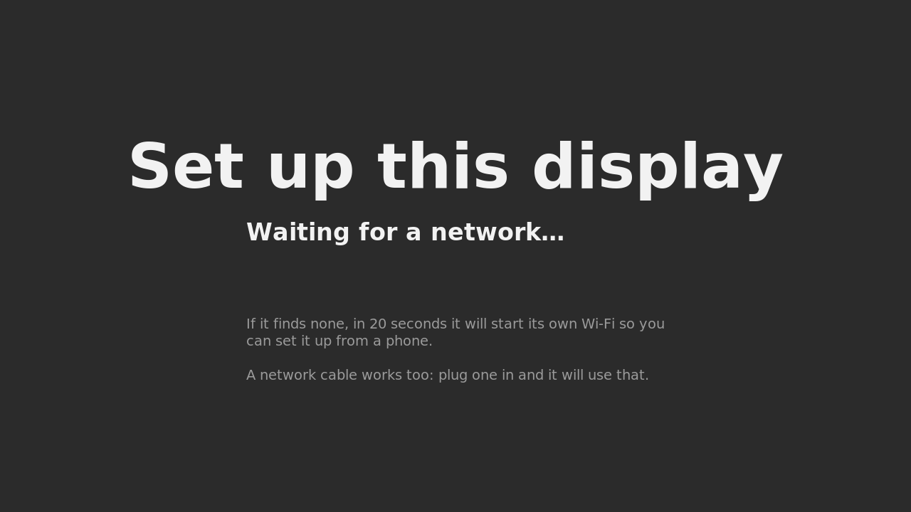

> [!TIP]
> A network cable works too. Plug one in at any time and the display uses it.

### 5. Join the display's own Wi-Fi

If it finds no network, the display starts **its own Wi-Fi**, named after the
display, and shows two QR codes.

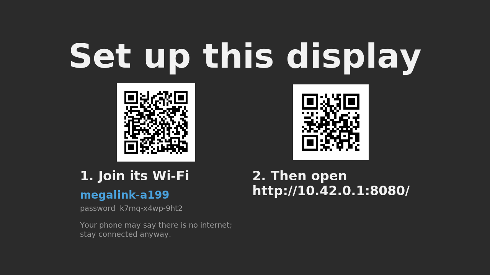

1. Open your phone's camera and point it at the **left-hand code**. Tap the
   message that appears to join the display's Wi-Fi. (Or join it by hand: the
   network name and password are on the screen.)
2. Your phone may warn that the network has **no internet**. That is expected.
   Choose to stay connected.
3. Point the camera at the **right-hand code**, and tap the link. The display's
   settings page opens.

### 6. Choose your Wi-Fi

Scroll down the settings page to **Wi-Fi**.

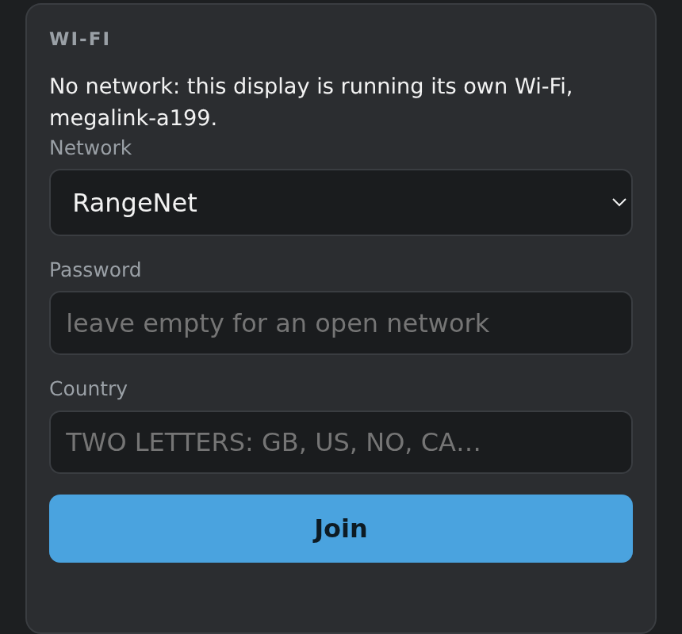

1. Choose your Wi-Fi from the **Network** list.
   If it is not there, choose **Another network…** and type its name exactly.
2. Type its **password**.
3. Type your **country** as two letters: `US`, `CA`, `GB`, `NO` and so on.
   This lets the display use every Wi-Fi channel your country allows.
4. Press **Join**.

Your phone drops off the display's Wi-Fi, because the display has left it to
join yours. Put your phone back on your usual Wi-Fi. After a few seconds the
screen shows **Set up this display** with a new QR code. Carry on with
*Choose what to show*.

> [!NOTE]
> If the password was wrong, the display's own Wi-Fi comes back within a
> minute, and the settings page says it could not join. Join it again and have
> another go.

## Choose what to show

### 7. Open the settings page

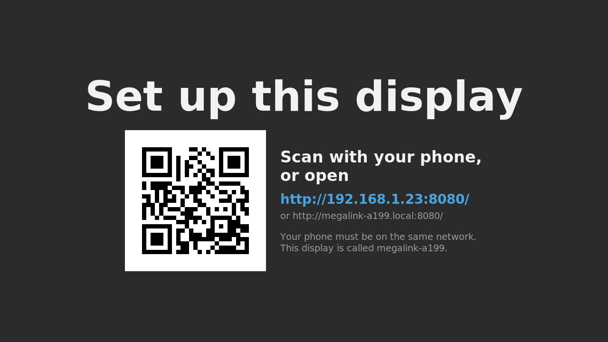

1. Make sure your phone is on the **same Wi-Fi as the display**.
2. Point your phone's camera at the QR code, and tap the link.

The display's settings page opens. You can also type the address shown on the
screen into any web browser on the same network.

### 8. Choose the club, range and firing point

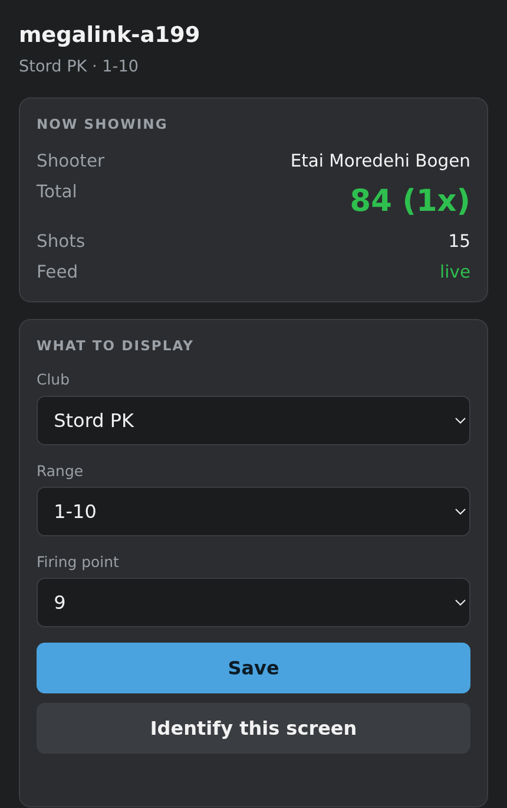

1. **Club:** choose your club. The list shows the clubs streaming on Megalink
   Live right now, so the range has to be switched on and streaming.
2. **Range:** choose the range.
3. **Firing point:** choose the firing point this screen stands beside.
4. Press **Save**.

The screen changes within a couple of seconds.

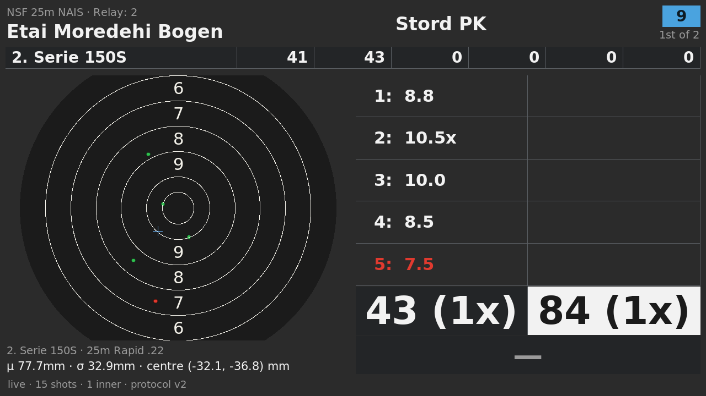

> [!TIP]
> Not sure which screen you are setting up? Press **Identify this screen**. The
> display flashes its name for a few seconds.

### What else is on the settings page

- **When nobody is shooting:** the message shown while the firing point is
  empty, or a picture instead, such as the club's badge.
- **This screen:** the display's name, and how it shows the scores (see
  *Ways to show the scores*).

The settings are kept on the display itself. Switch it off and on again and it
comes back showing the same firing point.

## Set up the whole range

Every display can see the others on the same network, and any of them can
change all of them. You do not have to walk from screen to screen.

### 9. Open the range page

On any display's settings page, tap **Manage all … displays on this range**
near the top, or add `/fleet` to its address, for example `http://192.168.1.23:8080/fleet`.

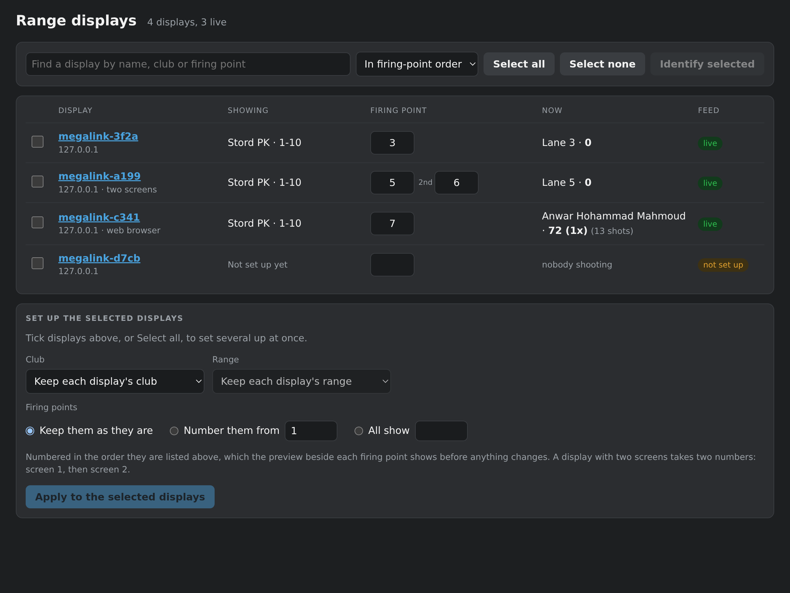

It lists every display it can hear, with what each is showing and who is
shooting there.

### Change one display

Type a new number in a display's **Firing point** box and press **Save** (or
Enter). A display with two screens has a second box, marked **2nd**.

### Set up many at once

1. Tick the displays to change, or press **Select all**.
2. Under **Set up the selected displays**, choose the **Club** and **Range**, or
   leave them as they are.
3. For the firing points, choose one of:
    - **Keep them as they are**,
    - **Number them from**, say, `1`: each display gets the next number, in
      the order they are listed, and one with two screens takes two numbers,
    - **All show** one firing point.
4. Check the arrows beside each firing point, which show what each display will
   get, then press **Apply**.

> [!TIP]
> To number a row in order, first **Identify** the displays one at a time and
> give each its number, or give them names like `fp-01`, `fp-02` and sort the
> page **In name order** before numbering.

## Two screens on one Pi

A **Raspberry Pi 4** or **Pi 5** can show a different firing point on each of
its two HDMI sockets. A Pi Zero 2 W and a Pi 3 have one.

1. Plug **screen 1** into **HDMI 0**, the socket next to the power, and
   **screen 2** into **HDMI 1**.
2. Open the display's settings page. With two screens plugged in, **What to
   display** has a firing point for each screen.
3. Choose screen 2's firing point, and press **Save**. The display restarts to
   set up both screens, which takes a few seconds.

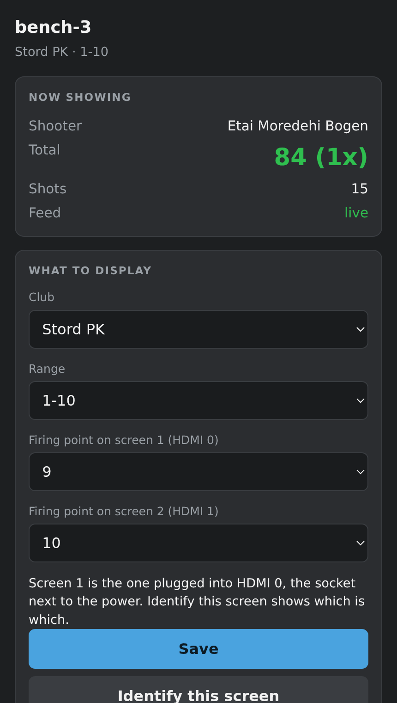

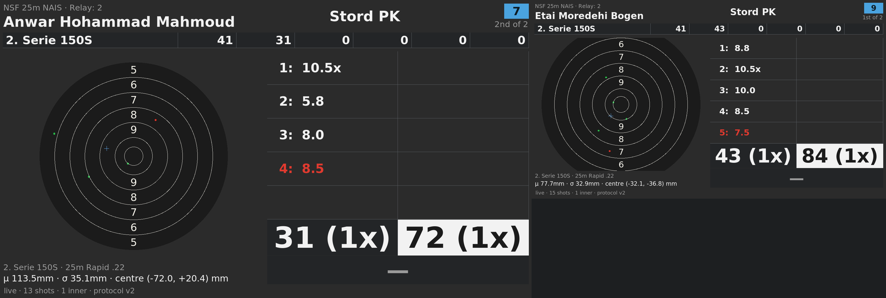

To show the same firing point on both screens, choose **Same as screen 1**.

> [!TIP]
> Not sure which screen is which? **Identify this screen** labels them
> "screen 1" and "screen 2" for a few seconds.

## Ways to show the scores

On the settings page, **This screen → Mode** chooses how a display shows the
scores. Changing it restarts the display, which takes a few seconds.

| Mode | What it shows | Best for |
|---|---|---|
| **Window** | The display draws the card itself: the target, the shots, the totals and the clock. | Every range. The default, and the only one quick on a Pi Zero 2 W. |
| **Web browser** | Megalink's own live web page, full screen. | A Pi 4 or Pi 5, for a discipline window mode does not draw well. |
| **Console** | The scores as text, without graphics. | Checking a display whose screen will not show a window. |

In web browser mode, the **Address** box can point the screen at a different
page, such as a local Megalink server (see *A range with no internet*).

## Everyday use

### Switching on and off

Switch a display off at the wall whenever you like. It saves its settings as it
goes, so a power cut loses nothing. Switch it on and it shows its firing point.

For its first ten seconds on the network, it shows its name, address and
network in the corner, so you can always find its settings page:

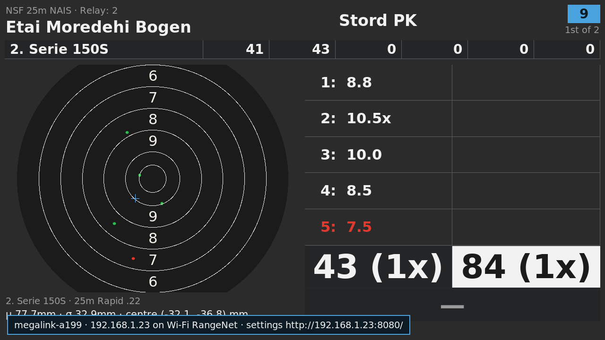

### Finding a display

- **Identify:** on the settings page or the range page. The display flashes its
  name for a few seconds.
- **The range page** lists every display on the network, by name.

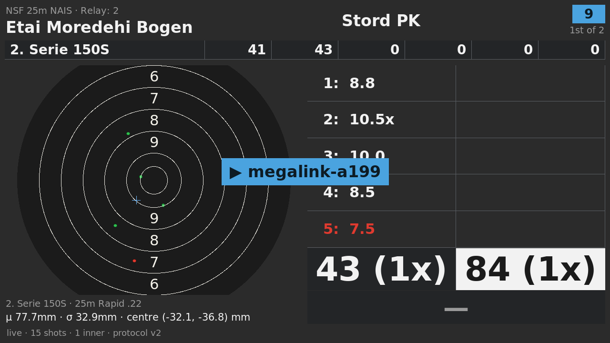

### When the Wi-Fi changes

If the range's Wi-Fi changes its name or password, a display cannot rejoin it.
It starts its own Wi-Fi again and shows the two QR codes: 30 seconds after it
is switched on, or two minutes after it loses a network it was on. Follow *Get
it on the network* to give it the new details.

### Starting again

To wipe a display and start again, write its card again with Raspberry Pi
Imager, as in *Put the software on the card*. Its settings are lost, so note
its firing point first.

### Keeping it secure

Anyone on the range's network can open a display's settings page and change it.
On a range's own network that is usually fine. On a network shared with the
public, a *token*, a password for changing the displays, can be set by someone
comfortable with a terminal: see the project's README.

## Edge cases and special setups

### A range with no internet

In window and console modes, a display gets the scores from Megalink Live on
the internet. Without an internet connection it has nothing to show: it says
**connecting to Megalink Live…**, or **could not reach** followed by an
address, and keeps trying.

**If your range runs Megalink's own live software on a computer at the range**,
the scores can be shown without the internet:

1. Put the displays on the same network as that computer.
2. On each display's settings page, set **Mode** to **Web browser**.
3. Set **Address** to the address of the page that software shows, and save.

The address depends on how that software is set up, so ask whoever runs your
club's Megalink system for it. It usually starts `http://` followed by the
computer's network address. Web browser mode needs a Pi 4 or Pi 5 to be quick.

### Guest Wi-Fi and networks that keep devices apart

Some Wi-Fi networks, often ones called "Guest", stop the devices on them from
reaching each other. On such a network your phone cannot open a display's
settings page, and the range page cannot see the other displays. Use a network
without that setting, or a network cable. Your network's administrator can tell
you whether *client isolation* is switched on.

### Wi-Fi a display cannot join

- **Networks with a sign-in page**, as in hotels and cafés, cannot be joined by
  a display: there is nobody to sign in.
- **Networks that ask for a user name as well as a password** (called
  *enterprise* or *WPA2-Enterprise*, such as eduroam) cannot be set from the
  settings page.
- **A hidden network** can be joined: choose **Another network…** and type its
  name exactly, including capitals.

Use a network cable in these cases, or a separate Wi-Fi for the displays.

### A network only on 5 GHz

A Pi Zero 2 W and a Pi 3 Model B only use 2.4 GHz Wi-Fi. A Pi 3 B+, Pi 4 and
Pi 5 use 5 GHz too, once they know your country, so type the country when you
join the Wi-Fi.

### The address does not open

The QR code uses the display's number address, such as
`http://192.168.1.23:8080/`, which works on every phone. The name address, such
as `http://megalink-a199.local:8080/`, is shorter to type but does not work on
every phone. If one does not open, try the other, and check your phone is on
the same Wi-Fi as the display.

### Web browser mode on a Pi Zero 2 W

It works, but a Pi Zero 2 W has little memory for a web browser, so pages are
slow to appear. Window mode shows the same scores far faster.

## When something is wrong

| What you see | What to do |
|---|---|
| **Nothing on the screen** | Check the screen is on the right input, and the cable is in **HDMI 0**. Check the power supply: the Pi's power light should be on. Give the first start two minutes. |
| **Waiting for a network…, and no countdown** | Wait two minutes. If nothing changes, switch it off and on again. |
| **Your phone will not stay on the display's Wi-Fi** | It is warning there is no internet. Choose to stay connected, or turn off mobile data while you set up. |
| **No networks in the Wi-Fi list** | Choose **Another network…** and type the name. |
| **The display will not join the Wi-Fi** | Check the password, and type the country. Its own Wi-Fi comes back within a minute so you can try again. |
| **The club is not in the list** | The list shows clubs streaming right now. Switch the range's Megalink system on and try again. |
| **"connecting to Megalink Live…" or "could not reach…"** | The display is on a network, but not the internet. Check the network has internet access. |
| **The QR code link does not open** | Put your phone on the same Wi-Fi as the display. See *The address does not open*. |
| **The range page does not list a display** | They must be on the same network. See *Guest Wi-Fi*. |
| **Both screens show the same firing point** | Choose screen 2's firing point on the settings page. |
| **The display restarts by itself** | Use a stronger power supply, ideally the official one. |

### Getting help

Questions and problems are welcome on the project's page:
**<https://github.com/null-jones/rpi-megalink-viewer/issues>**.
Include the display's model of Pi, the mode it is in, and what the screen shows.

The project is independent of Megalink AS. For questions about Megalink Live
itself, or your range's Megalink system, ask Megalink or your supplier.
